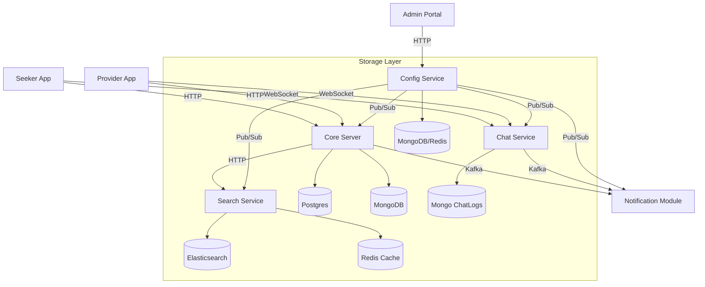
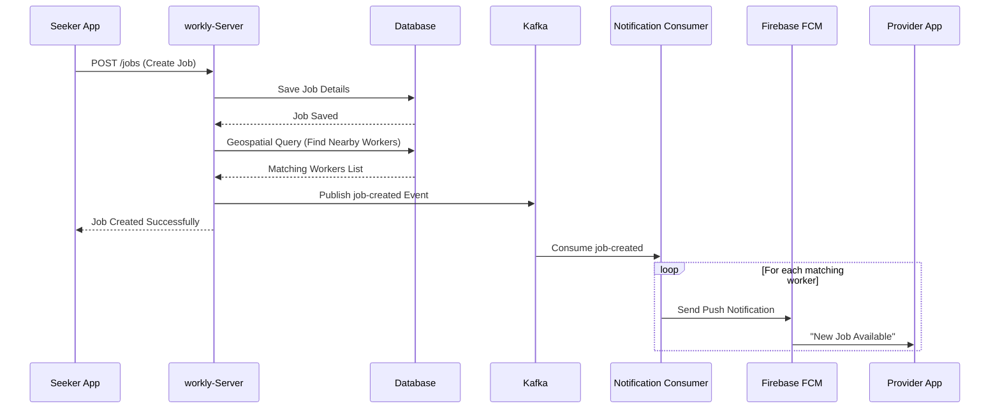
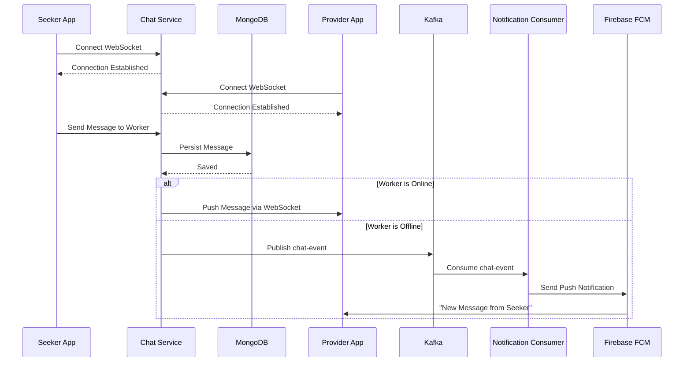
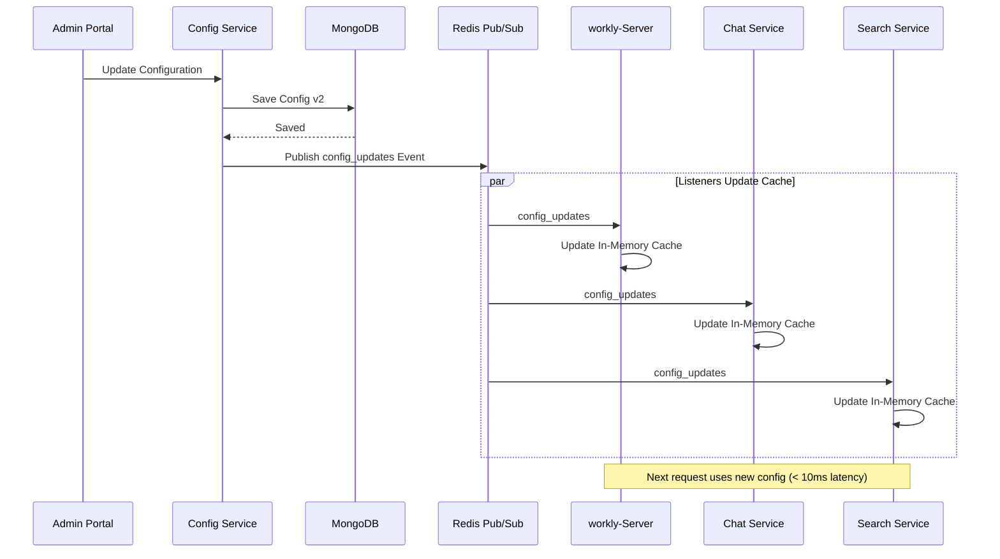
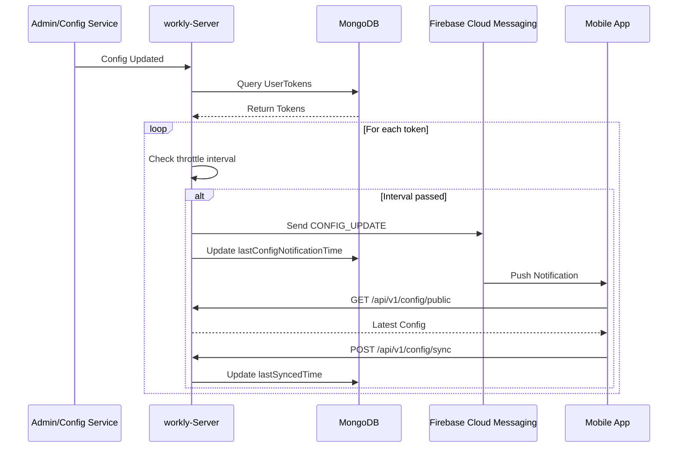

# System Architecture

## High-Level Overview

Workly operates on a microservices-based architecture where specialized components handle Auth, Matching, Chat, and Search interactively.



## Module Responsibilities

### 1. Core Server (`workly-Server`)
*   **Authentication**: OTP-based login (Twilio/Mock).
*   **Job Management**: CRUD for Jobs, Assignments, and Status updates.
*   **Matching Engine**: Geospatial queries to find providers within range.
*   **Notifications**: Consumes Kafka events to send FCM push notifications.

### 2. Chat Service (`workly-Chat-Service`)
*   **Protocol**: WebSocket (`/ws/chat`).
*   **Persistence**: "Persist-before-Delivery" model using MongoDB.
*   **Events**: Publishes `chat-events` to Kafka for notifications.
*   **Security**: Token-based handshake authentication.

### 3. Search Service (`workly-Search-Service`)
*   **Goal**: Normalize messy user input into canonical skills (e.g., "electrisian" -> "Electrician").
*   **Stack**: Elasticsearch for Fuzzy/Phonetic search, Redis for Prefix caching.
*   **Data Flow**:
    ```mermaid
    sequenceDiagram
        Client->>API: Autocomplete "elec"
        API->>Redis: Check Cache
        alt Cache Hit
            Redis-->>Client: ["Electrician"]
        else Cache Miss
            API->>Elastic: Fuzzy Search "elec"
            Elastic-->>API: ["Electrician"]
            API->>Redis: Cache Result
            API-->>Client: ["Electrician"]
        end
    ```

## Key Flows

### Job Creation & Notification



### Real-Time Chat



### Configuration Flow (Server-Side Runtime)



### Dynamic Configuration Sync to Mobile Apps

The platform implements real-time configuration synchronization using **Firebase Cloud Messaging (FCM)** to push updates to mobile applications without requiring app updates.



**Key Components:**
- **Throttling**: Notifications limited to 1-hour intervals per device (configurable)
- **Tracking**: `UserToken` stores `lastConfigNotificationTime` and `lastSyncedTime`
- **Endpoints**: 
  - `GET /api/v1/config/public` - Fetch latest configuration
  - `POST /api/v1/config/sync` - Acknowledge sync completion
- **Mobile Integration**: Apps listen for `CONFIG_UPDATE` FCM messages and trigger `ConfigManager.syncConfig()`
