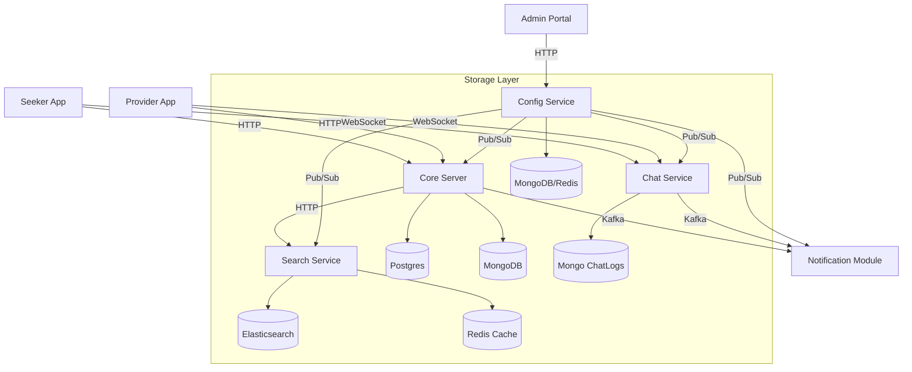

# System Architecture

## High-Level Overview

Workly operates on a microservices-based architecture where specialized components handle Auth, Matching, Chat, and Search interactively.



## Module Responsibilities

### 1. Core Server (`workly-Server`)
*   **Authentication**: OTP-based login (Twilio/Mock).
*   **Job Management**: CRUD for Jobs, Assignments, and Status updates.
*   **Matching Engine**: Geospatial queries to find providers within range.
*   **Notifications**: Consumes Kafka events to send FCM push notifications.

### 2. Chat Service (`workly-Chat-Service`)
*   **Protocol**: WebSocket (`/ws/chat`).
*   **Persistence**: "Persist-before-Delivery" model using MongoDB.
*   **Events**: Publishes `chat-events` to Kafka for notifications.
*   **Security**: Token-based handshake authentication.

### 3. Search Service (`workly-Search-Service`)
*   **Goal**: Normalize messy user input into canonical skills (e.g., "electrisian" -> "Electrician").
*   **Stack**: Elasticsearch for Fuzzy/Phonetic search, Redis for Prefix caching.
*   **Data Flow**:
    ```mermaid
    sequenceDiagram
        Client->>API: Autocomplete "elec"
        API->>Redis: Check Cache
        alt Cache Hit
            Redis-->>Client: ["Electrician"]
        else Cache Miss
            API->>Elastic: Fuzzy Search "elec"
            Elastic-->>API: ["Electrician"]
            API->>Redis: Cache Result
            API-->>Client: ["Electrician"]
        end
    ```

## Key Flows

### Job Creation & Notification
1.  **Seeker** Posts Job (API).
2.  **API** saves Job to Mongo/Postgres.
3.  **API** finds matching Workers (Geospatial).
4.  **API** publishes `job-created` event (Kafka).
5.  **Notification Consumer** triggers FCM to Workers.

### Real-Time Chat
1.  **Seeker** connects to WebSocket.
2.  **Seeker** sends message to **Worker**.
3.  **Chat Service** saves to MongoDB.
4.  **Chat Service** pushes to **Worker's** active socket.
5.  If Worker is offline, **Chat Service** publishes `chat-event` to Kafka.
6.  **Notification Consumer** sends generic FCM "New Message".

### Configuration Flow (Runtime)
   - **Admin** updates config in **Portal** -> **Config Service** saves to Mongo (v2) -> Publishes `config_updates` event to **Redis**.
   - **workly-Server** (and others) listens to **Redis** -> Updates local in-memory cache.
   - **Next Request** uses new config value immediately (latency < 10ms).
