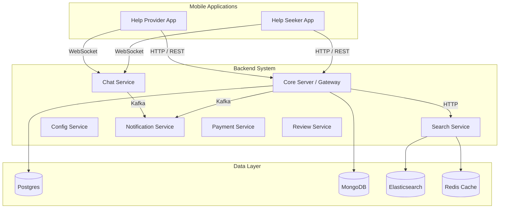
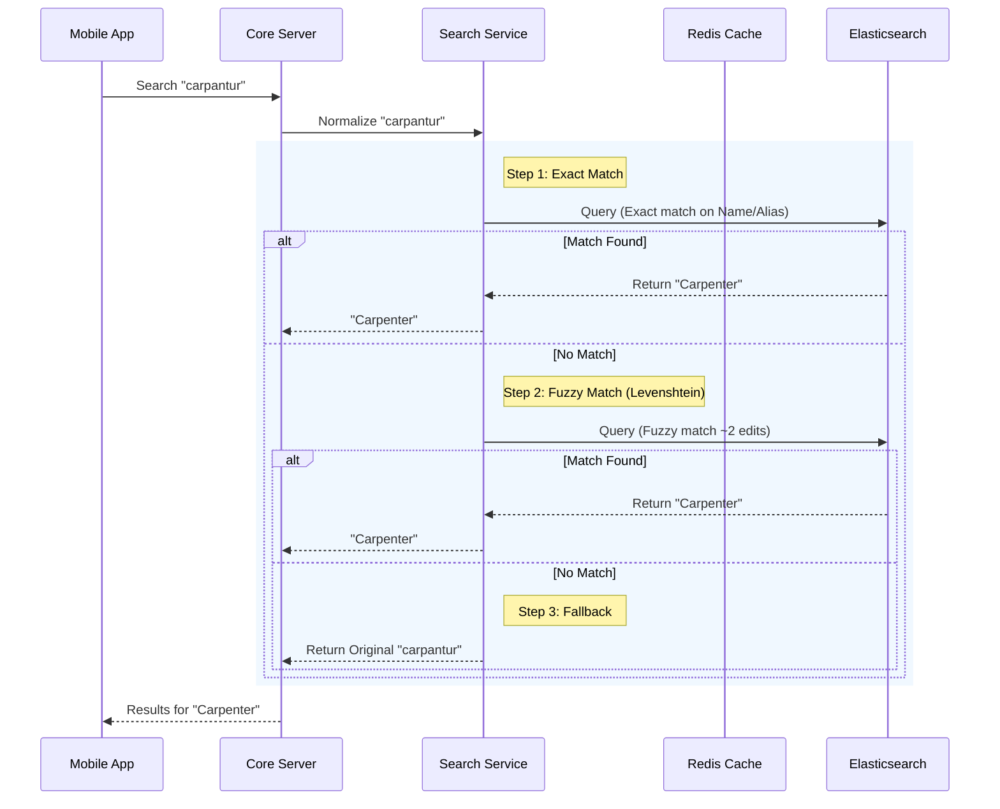
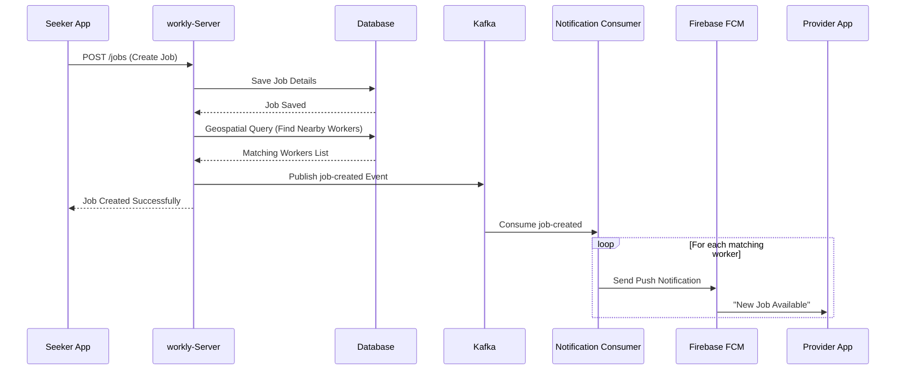
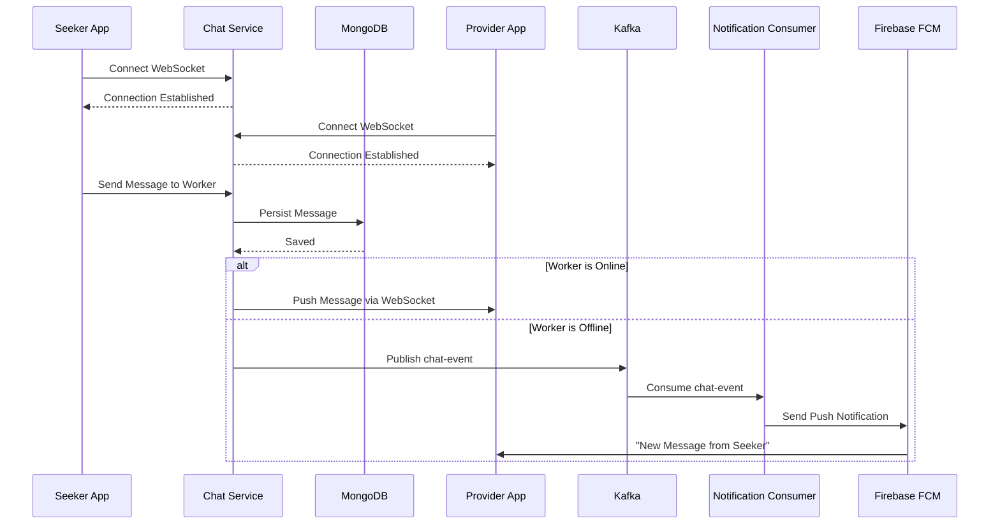
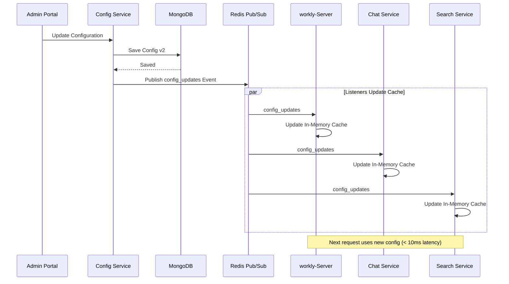
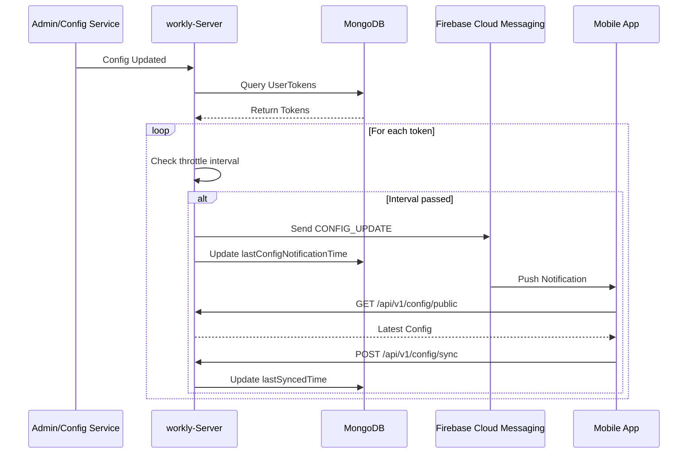

# System Architecture

## High-Level Overview

Workly operates on a microservices-based architecture where specialized components handle Auth, Matching, Chat, and Search interactively.



## Expertise & Spelling Normalization

The system handles misspelled skills (e.g., "carpantur" -> "Carpenter") using a multi-step normalization process in the **Search Service**.

### Spelling Correction Flow



### Technical Implementation Details

Based on the `AutocompleteService` and `SkillDocument` implementation:

1.  **Index Structure (`skills_index`)**:
    *   **Documents**: Each skill is a document containing a `canonicalName` (e.g., "Electrician") and a list of `aliases` (e.g., ["wiring expert", "lineman", "electrican"]).
    *   **Mapping**: `aliases` are stored as a standard text field.

2.  **Fuzzy Match Logic (Levenshtein)**:
    The search query in `AutocompleteService.searchInElasticsearch` constructs a **Boolean OR** criteria that attempts to match in three ways simultaneously:
    *   **Prefix Match**: `Criteria("canonicalName").contains(query)` - Finds exact substring matches.
    *   **Fuzzy Match**: `Criteria("canonicalName").fuzzy(query)` - Applies Edit Distance (Levenshtein). ElasticSearch's default `AUTO` setting is used:
        *   **0 edits** allowed for strings < 3 characters.
        *   **1 edit** allowed for strings 3-5 characters.
        *   **2 edits** allowed for strings > 5 characters.
    *   **Alias Match**: `Criteria("aliases").is(query)` - Checks the `aliases` array for a match.

This approach ensures that "plumer" matches "Plumber" (via Fuzzy) and "wiring expert" matches "Electrician" (via Alias) in a single query execution.

## Module Responsibilities

### 1. Core Server (`workly-Server`)
*   **Authentication**: OTP-based login (Twilio/Mock).
*   **Job Management**: CRUD for Jobs, Assignments, and Status updates.
*   **Matching Engine**: Geospatial queries to find providers within range.
*   **Notifications**: Consumes Kafka events to send FCM push notifications.

### 2. Chat Service (`workly-Chat-Service`)
*   **Protocol**: WebSocket (`/ws/chat`).
*   **Persistence**: "Persist-before-Delivery" model using MongoDB.
*   **Events**: Publishes `chat-events` to Kafka for notifications.
*   **Security**: Token-based handshake authentication.

### 3. Search Service (`workly-Search-Service`)
*   **Goal**: Normalize messy user input into canonical skills (e.g., "electrisian" -> "Electrician").
*   **Stack**: Elasticsearch for Fuzzy/Phonetic search, Redis for Prefix caching.
*   **Data Flow**:
    ```mermaid
    sequenceDiagram
        Client->>API: Autocomplete "elec"
        API->>Redis: Check Cache
        alt Cache Hit
            Redis-->>Client: ["Electrician"]
        else Cache Miss
            API->>Elastic: Fuzzy Search "elec"
            Elastic-->>API: ["Electrician"]
            API->>Redis: Cache Result
            API-->>Client: ["Electrician"]
        end
    ```

## Key Flows

### Job Creation & Notification



### Real-Time Chat



### Configuration Flow (Server-Side Runtime)



### Dynamic Configuration Sync to Mobile Apps

The platform implements real-time configuration synchronization using **Firebase Cloud Messaging (FCM)** to push updates to mobile applications without requiring app updates.



**Key Components:**
- **Throttling**: Notifications limited to 1-hour intervals per device (configurable)
- **Tracking**: `UserToken` stores `lastConfigNotificationTime` and `lastSyncedTime`
- **Endpoints**: 
  - `GET /api/v1/config/public` - Fetch latest configuration
  - `POST /api/v1/config/sync` - Acknowledge sync completion
- **Mobile Integration**: Apps listen for `CONFIG_UPDATE` FCM messages and trigger `ConfigManager.syncConfig()`

---

## Future Architecture Enhancements

To see the detailed business functionality gaps this architecture will address, refer to the [Product Roadmap](PRODUCT_ROADMAP.md). Upcoming architectural changes include:

*   **Payment & Escrow Layer**: Integration of a dedicated internal service communicating with Stripe/Razorpay via HTTP. This will hold funds in a `Postgres` transactions table before disbursing via payout APIs.
*   **KYC & Verification**: A background worker to pass provider uploaded ID documents to a 3rd party OCR/verification service, updating the `Mongo` user context asynchronously.
*   **Review Engine**: An asynchronous feedback processing engine using `Kafka` logging and aggregated in `Elasticsearch` for swift provider ranking changes upon new reviews.
