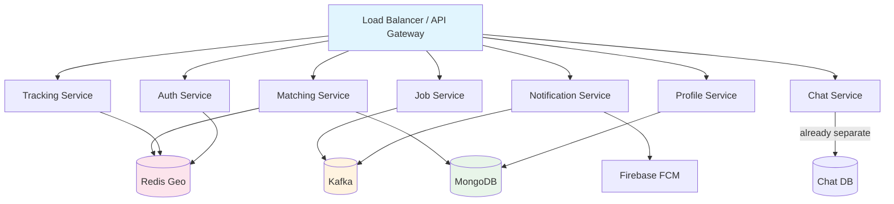

# Workly — High-Scale Architecture Audit & Roadmap

> **Goal:** Evaluate whether the current Workly backend can sustain Ola/Uber/WhatsApp-level traffic (millions of concurrent users, sudden 10–50× spikes during rush hours or events), identify every architectural bottleneck, and lay out a phased remediation plan.

---

## Executive Summary

The current Workly server is a **single-process Spring Boot monolith** backed by MongoDB, PostgreSQL, Redis, Kafka (single broker), and Elasticsearch — all running on `localhost`. It handles authentication, job lifecycle, matching, notifications, tracking, payments, and analytics in one deployment unit. While well-structured with clean module separation and some strong primitives (Redis distributed locks, Kafka outbox pattern), **it would collapse under Ola/Uber-scale load** for the following structural reasons:

| Area | Current State | Risk Level |
|------|--------------|------------|
| Deployment | Single JVM on one machine | 🔴 Critical |
| Database | Single MongoDB + PostgreSQL, no replicas | 🔴 Critical |
| Kafka | 1 broker, replication-factor=1 | 🔴 Critical |
| Job Matching | Full table scan of all BROADCASTED jobs | 🔴 Critical |
| WebSocket Tracking | In-memory `ConcurrentHashMap`, no clustering | 🔴 Critical |
| Outbox Relay | Polling every 5s, sequential processing | 🟡 High |
| FCM Notifications | Synchronous, blocking the Kafka consumer | 🟡 High |
| Location Updates | Direct MongoDB write per GPS ping | 🟡 High |
| Caching | No application-level read caching | 🟡 High |
| Rate Limiting | None on API endpoints | 🟡 High |
| Auth/OTP | Redis-backed, functional but no rate-limit | 🟢 Medium |
| Observability | Logging only, no metrics/tracing | 🟢 Medium |

---

## Detailed Analysis

### 1. Single-Point-of-Failure Monolith

> [!CAUTION]
> **The server runs as a single JVM.** If this process dies, the entire platform — job creation, matching, payments, notifications, and tracking — goes offline simultaneously.

**Current:** `app.mode = monolith` in [application.yml](file:///Users/sj/codebase/workly/workly-Server/src/main/resources/application.yml#L69). All 19 modules (auth, job, matching, notification, tracking, profile, payment, analytics, etc.) are compiled and deployed as one unit.

**Why it fails at scale:**
- A memory leak in analytics takes down job creation
- A Kafka consumer lag in notifications blocks the entire thread pool
- You cannot independently scale the hot path (job matching, location tracking) without also scaling the cold path (reports, admin)
- Zero-downtime deployments are impossible — a restart means a global outage

**What Uber/Ola do:** Decompose into independently deployable services with their own databases, scaling policies, and failure boundaries.

---

### 2. Database Bottlenecks

#### 2a. MongoDB — No Replica Set, No Sharding

**Current:** Single `mongodb://localhost:27017/workly` instance in [docker-compose.yml](file:///Users/sj/codebase/workly/docker/docker-compose.yml#L4-L9).

**Why it fails:**
- A single MongoDB node has a write throughput ceiling around ~5,000–10,000 ops/sec depending on document size
- Ola processes **~1 million ride requests per day** in a single city; at peak that's 50,000+ writes/sec
- No replication = data loss on disk failure
- GeoSpatial queries on the `jobs` collection (2dsphere index) will degrade as the collection grows past a few million documents
- The [getMatchingJobs()](file:///Users/sj/codebase/workly/workly-Server/src/main/java/com/workly/modules/job/JobService.java#L210-L213) method does `findByStatusIn(BROADCASTED, SCHEDULED)` which is a **full collection scan** with no geo filter — this will return ALL open jobs nationally

#### 2b. PostgreSQL — Used for Outbox Only, But Still Single Node

The outbox events table will grow unbounded and queries on `processed = false` will slow as the table grows.

#### 2c. No Read Replicas

Every API call — including read-heavy endpoints like `/jobs/available`, `/jobs/worker`, and `/jobs/seeker` — hits the primary MongoDB instance directly. Under load, reads compete with writes for I/O.

---

### 3. Job Matching is O(N) — The Hottest Path is the Slowest

> [!WARNING]
> **This is the single most dangerous bottleneck.** Every time a provider opens the app, the server fetches ALL BROADCASTED+SCHEDULED jobs in the entire database.

**Current code in** [JobService.java](file:///Users/sj/codebase/workly/workly-Server/src/main/java/com/workly/modules/job/JobService.java#L210-L213):
```java
public List<Job> getMatchingJobs(String workerMobile) {
    // For now, return all BROADCASTED and SCHEDULED jobs.
    return jobRepository.findByStatusIn(
        List.of(JobStatus.BROADCASTED, JobStatus.SCHEDULED));
}
```

With 100,000 open jobs and 50,000 providers polling every 30 seconds, this generates **~1,667 queries/sec**, each returning 100K documents. The MongoDB driver will serialize hundreds of megabytes of BSON per second. The JVM will OOM.

**What needs to happen:**
- Filter by geolocation (use the existing 2dsphere index)
- Filter by skill match
- Paginate results (max 20–50 per request)
- Cache hot geo-cells in Redis

---

### 4. WebSocket Tracking Uses In-Memory State

**Current:** [TrackingWebSocketHandler.java](file:///Users/sj/codebase/workly/workly-Server/src/main/java/com/workly/modules/tracking/TrackingWebSocketHandler.java#L20) stores all active sessions in:
```java
private final Map<String, Map<String, WebSocketSession>> jobSessions = new ConcurrentHashMap<>();
```

**Why it fails at scale:**
- If you run 2+ server instances behind a load balancer, the Provider's WebSocket may connect to Server A while the Seeker connects to Server B — they'll never see each other's location updates
- A single JVM can hold ~10,000–50,000 WebSocket connections before hitting file descriptor limits and memory pressure
- Uber handles **millions of concurrent location streams** — this requires a dedicated real-time messaging layer (Redis Pub/Sub, NATS, or a dedicated service)

---

### 5. Kafka Infrastructure is Non-Resilient

**Current:** Single Kafka broker with `KAFKA_OFFSETS_TOPIC_REPLICATION_FACTOR: 1` in [docker-compose.yml](file:///Users/sj/codebase/workly/docker/docker-compose.yml#L46).

**Why it fails:**
- If the broker dies, ALL event processing stops — no notifications, no job status updates, no outbox relay
- Single partition by default = single consumer thread = no parallelism
- The outbox relay in [OutboxRelayScheduler.java](file:///Users/sj/codebase/workly/workly-Server/src/main/java/com/workly/modules/job/outbox/OutboxRelayScheduler.java#L19) polls every 5 seconds and processes **sequentially** (breaks on first failure) — during a spike, events will queue up for minutes

**What Uber/WhatsApp do:** 3+ broker Kafka cluster, topic partitioning by region/jobId, independent consumer groups per downstream service, replication factor ≥ 3.

---

### 6. Notification Processing is Synchronous and Blocking

**Current:** In [NotificationService.java](file:///Users/sj/codebase/workly/workly-Server/src/main/java/com/workly/modules/notification/NotificationService.java#L69-L72), when a job is created, we loop through ALL matching workers and send FCM pushes one-by-one:

```java
for (WorkerProfile worker : matchingWorkers) {
    sendPushNotification(worker.getDeviceToken(), ...);
}
```

For a job in a dense area with 500+ matching workers, this loop blocks the Kafka consumer thread for the entire duration. During that time, no other `job.created` events are processed.

Additionally, [notifyNewlyAvailableWorker()](file:///Users/sj/codebase/workly/workly-Server/src/main/java/com/workly/modules/notification/NotificationService.java#L83-L124) loads ALL BROADCASTED jobs into memory and iterates through them with manual Haversine distance calculations — this is an O(jobs × workers) operation.

---

### 7. Location Updates Write Directly to MongoDB

**Current:** [LocationService.java](file:///Users/sj/codebase/workly/workly-Server/src/main/java/com/workly/modules/location/LocationService.java#L15-L22) calls `profileService.updateLocation()` which does a `workerRepository.save()` on every GPS ping.

With 100,000 active providers sending location every 5 seconds = **20,000 writes/sec** just for location, all going through the full save pipeline (read profile, update, write back).

**What Uber does:** Write to a fast in-memory store (Redis Geo), batch-flush to persistent storage periodically.

---

### 8. No API Rate Limiting or Circuit Breaking

**Current:** No rate limiting middleware exists. The OTP service comment mentions "Rate limiting handled at API Gateway layer" in [OtpService.java](file:///Users/sj/codebase/workly/workly-Server/src/main/java/com/workly/modules/auth/OtpService.java#L23-L25), but there is no API gateway.

A single misbehaving client (or a DDoS) could exhaust the thread pool and crash the server.

---

### 9. No Application-Level Caching

**Current:** The [RuntimeConfigCache](file:///Users/sj/codebase/workly/workly-Server/src/main/java/com/workly/config/RuntimeConfigCache.java) exists for config values, but there is **no caching** for:
- Worker profiles (fetched on every `toDto()` call via `profileService.getWorkerProfile()`)
- Job listings (identical queries by thousands of providers hit MongoDB every time)
- Available jobs by geo-cell

The [toDto()](file:///Users/sj/codebase/workly/workly-Server/src/main/java/com/workly/modules/job/JobController.java#L179-L223) method in JobController calls `profileService.getWorkerProfile()` for **every single job** in a list response. Fetching 50 jobs = 50 additional MongoDB queries just for worker names.

---

## Proposed Changes — Phased Roadmap

### Phase 0: Critical Fixes (No Architecture Change)
> *Effort: 1–2 days. These are code-only changes with immediate impact.*

| # | Change | File(s) | Why |
|---|--------|---------|-----|
| 0.1 | **Fix `getMatchingJobs()` to filter by geo + skills** | `JobService.java`, `JobRepository.java` | Currently returns ALL open jobs. Add `@Query` with `$nearSphere` and `$in` on `requiredSkills`. This alone reduces response payloads by 95%+ |
| 0.2 | **Add pagination to job listing endpoints** | `JobController.java`, `JobService.java` | Return max 20 jobs per request with cursor-based pagination |
| 0.3 | **Batch FCM notifications** | `NotificationService.java` | Use Firebase's `sendEach()` batch API (up to 500 per call) instead of looping individually |
| 0.4 | **Cache worker profiles in Redis** | `ProfileService.java` | Add `@Cacheable` with 5-min TTL on `getWorkerProfile()` — eliminates N+1 queries in `toDto()` |
| 0.5 | **Write location to Redis Geo first** | `LocationService.java` | Use `GEOADD` for hot location data, async-flush to MongoDB every 60s |
| 0.6 | **Add API rate limiting** | New `RateLimitFilter.java` | Use Redis + token-bucket algorithm. Limit: 60 req/min per user for reads, 10/min for writes |

---

### Phase 1: Resilient Infrastructure
> *Effort: 3–5 days. Docker/infra changes, no significant code rewrites.*

| # | Change | Why |
|---|--------|-----|
| 1.1 | **MongoDB Replica Set (1 primary + 2 secondaries)** | Read scalability + automatic failover. Route read-heavy queries to secondaries |
| 1.2 | **Kafka 3-broker cluster with replication-factor=3** | Zero message loss, parallel consumption via partitioning |
| 1.3 | **Partition Kafka topics by region/city** | Enables parallel consumers per region; prevents one city's surge from blocking another |
| 1.4 | **Redis Sentinel or Cluster** | Redis is currently a SPOF for auth (OTP), distributed locks, and caching |
| 1.5 | **PostgreSQL with connection pooling (PgBouncer)** | Outbox table needs connection management under load |

---

### Phase 2: Horizontal Scaling
> *Effort: 1–2 weeks. Structural code changes to enable multi-instance deployment.*

| # | Change | Why |
|---|--------|-----|
| 2.1 | **Stateless server instances behind a load balancer** | Run 3+ JVM instances. Requires externalizing all in-memory state (WebSocket sessions, config cache) |
| 2.2 | **WebSocket sessions via Redis Pub/Sub** | Tracking handler publishes location to Redis channel; all instances subscribe. Eliminates the `ConcurrentHashMap` single-node constraint |
| 2.3 | **Outbox relay with distributed lock** | Use `ShedLock` or Redis-based leader election so only one instance runs the outbox scheduler at a time (or partition by topic) |
| 2.4 | **Sticky sessions for WebSocket connections** | Configure load balancer (e.g., Nginx) with `ip_hash` or upgrade to use a dedicated WebSocket gateway |
| 2.5 | **Health checks and graceful shutdown** | Add `/actuator/health` with readiness/liveness probes for container orchestrators |

---

### Phase 3: Service Decomposition (Microservices)
> *Effort: 3–6 weeks. Split the monolith along natural domain boundaries.*



**Recommended service boundaries:**

| Service | Current Module(s) | Why Separate |
|---------|-------------------|-------------|
| **Auth Service** | `auth`, `verification` | Extremely high call rate (every request validates JWT). Needs independent scaling |
| **Job Service** | `job`, `job/outbox` | Core business logic. Owns the `jobs` collection |
| **Matching Service** | `matching`, `search` | Computationally expensive geo+skill queries. Benefits from dedicated Redis Geo cache and read replicas |
| **Notification Service** | `notification` | I/O-bound (FCM calls). Should scale independently from CPU-bound matching |
| **Tracking Service** | `tracking`, `location` | WebSocket-heavy, real-time data. Completely different scaling profile (long-lived connections vs. request/response) |
| **Profile Service** | `profile`, `worker` | Heavily read, rarely written. Perfect candidate for aggressive caching |
| **Chat Service** | Already `workly-Chat-Service` | Already extracted, just needs production hardening |

---

### Phase 4: Production-Grade Capabilities
> *Effort: Ongoing. Platform engineering concerns.*

| # | Capability | Implementation |
|---|-----------|---------------|
| 4.1 | **Observability** | Prometheus metrics + Grafana dashboards + distributed tracing (Jaeger/Zipkin) |
| 4.2 | **Circuit Breaking** | Resilience4j circuit breakers on all inter-service calls and FCM |
| 4.3 | **Auto-scaling** | Kubernetes HPA based on CPU/request-rate. Tracking service scales on WebSocket connection count |
| 4.4 | **CDN & API Gateway** | Kong or AWS API Gateway for rate limiting, auth offloading, request routing |
| 4.5 | **Database Sharding** | Shard `jobs` collection by city/region for geographic locality |
| 4.6 | **Event Sourcing for Jobs** | Replace outbox pattern with native event sourcing — every status change is an immutable event. Enables replay, audit, and CQRS |
| 4.7 | **Connection Pooling** | MongoDB connection pool tuning, HTTP client pools for inter-service communication |
| 4.8 | **Backpressure** | Kafka consumer with explicit back-pressure and dead-letter queues for poison messages |

---

## Capacity Estimates (Ola/Uber Scale)

For context, here are approximate numbers for an Ola-like platform at scale:

| Metric | Value | Current Workly Capacity |
|--------|-------|------------------------|
| Concurrent users | 5M+ | ~100 (single JVM) |
| Job postings/day | 1M+ | ~1,000 before degradation |
| Location updates/sec | 200,000+ | ~500 (direct MongoDB writes) |
| FCM pushes/min | 500,000+ | ~100 (synchronous loop) |
| WebSocket connections | 1M+ | ~10,000 (single process) |
| API requests/sec | 100,000+ | ~500 (single JVM, no caching) |

---

## Priority Recommendation

> [!IMPORTANT]
> **Start with Phase 0.** These are pure code changes (no infrastructure) that will give you a **10–100× throughput improvement** immediately. The geo-filtered matching query alone (0.1) is the difference between "works for 100 users" and "works for 100,000 users."

After Phase 0, the priority depends on your growth curve:
- **Growing to 10K users →** Phase 0 is sufficient
- **Growing to 100K users →** Phase 0 + Phase 1 (resilient infra)
- **Growing to 1M+ users →** All phases, with Phase 2 and 3 running in parallel

---

## Open Questions

> [!IMPORTANT]
> Before proceeding with implementation, please review:

1. **What is your target scale?** 10K users? 100K? 1M+? This determines which phases are actually needed vs. premature optimization.
Answer: 1M+ (not now, but app should be autoscalbel to support in future without any change)
2. **Deployment target?** AWS/GCP/Azure? Kubernetes? Docker Compose on a VPS? This affects infrastructure decisions in Phase 1–2.
Answer: I will use AWS and Kubernetes on a VPS (but not dounded to AWS, deployment should be flexible).
3. **Should we start implementing Phase 0 now?** These are safe, non-breaking code changes that I can implement immediately.
Answer: yes
4. **Is the Chat Service (`workly-Chat-Service`) already production-hardened?** Or does it need the same audit?
Answer: audit everything including Chat service
