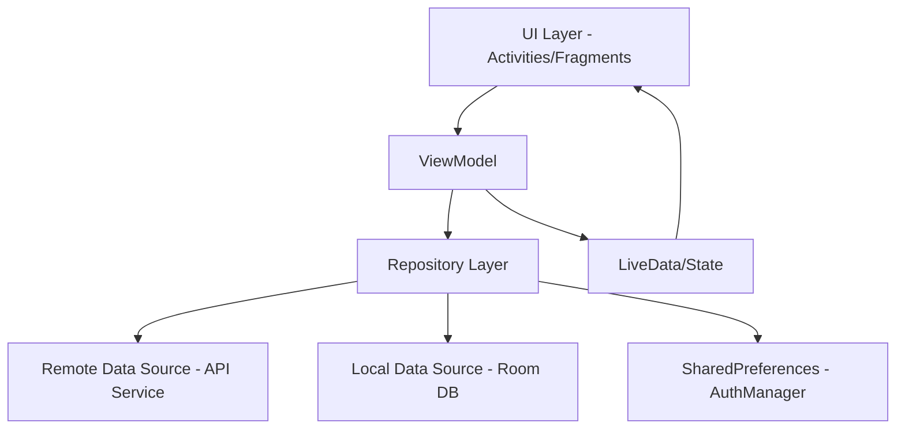
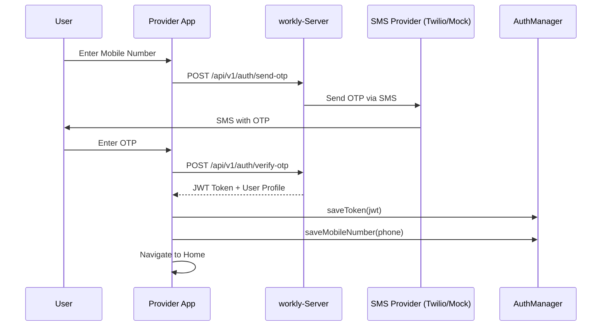
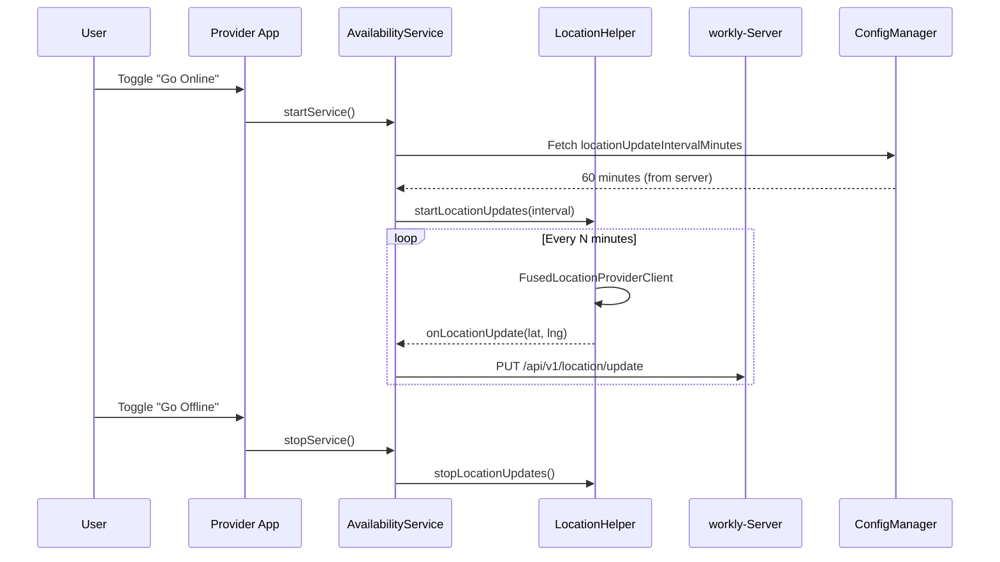
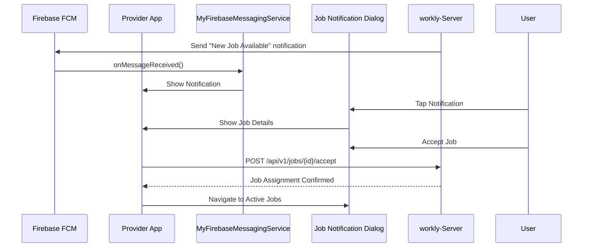
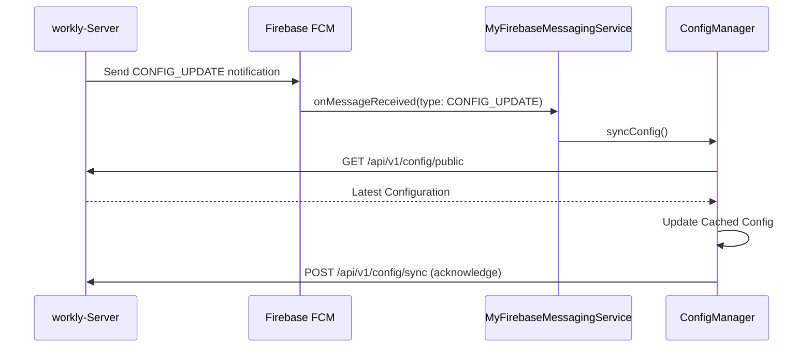
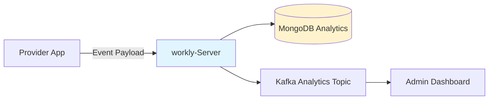

# Workly Help Provider App - Architecture

## Overview

The **Workly Help Provider** app is a native Android application for service providers (workers/helpers) to receive job requests, manage their availability, track location, and communicate with job seekers.

---

## Architecture Pattern

**MVVM (Model-View-ViewModel)** with **Repository Pattern**



### Key Components

- **UI Layer**: Activities, Fragments, XML Layouts, ViewBinding
- **ViewModel**: Business logic, state management
- **Repository**: Single source of truth, coordinates data sources
- **Data Sources**:
  - Remote: Retrofit API calls to `workly-Server`
  - Local: Room Database for offline caching
  - Preferences: AuthManager for JWT tokens and user info
- **DI**: Dagger Hilt for dependency injection

---

## Key Flows

### 1. Authentication Flow (OTP-based)



**Metrics Tracked:**
- Total OTPs sent (`otpSentCount`)
- OTP verification success/failure rate
- SMS provider API calls

### 2. Availability & Location Tracking



**Third-Party Services:**
- **Google Play Services Location** (Free tier, requires Google API Console setup)
- Future: **Google Maps SDK** for visual location display

**Metrics Tracked:**
- Total location updates sent
- Location accuracy stats
- Maps load count (when implemented)

### 3. Job Notification & Acceptance



**Third-Party Services:**
- **Firebase Cloud Messaging (FCM)** - Free tier (unlimited messages)

**Metrics Tracked:**
- FCM notifications received
- Job acceptance rate
- Time to respond to notification

### 4. Dynamic Configuration Sync



---

## Third-Party Services & Dependencies

### Free Services
| Service | Purpose | Cost | Setup Required |
|---------|---------|------|----------------|
| **Firebase Cloud Messaging** | Push notifications | Free | Firebase Console project |
| **Google Play Services Location** | GPS tracking | Free | Google API Console |
| **Retrofit** | HTTP client | Free (Open Source) | N/A |
| **Room** | Local database | Free (Android Jetpack) | N/A |
| **Dagger Hilt** | Dependency injection | Free (Open Source) | N/A |

### Planned Paid Services
| Service | Purpose | Estimated Cost | Status |
|---------|---------|----------------|--------|
| **Google Maps SDK** | Map visualization | ~$2 per 1000 loads (free tier: 28,000/month) | Planned |
| **Twilio SMS** | OTP delivery (production) | ~$0.0079 per SMS | Configured (mock in dev) |

---

## Data Storage

### EncryptedSharedPreferences (AuthManager)
- `auth_token`: JWT for API authentication
- `mobile_number`: User's phone number

### Room Database (Planned)
- Offline job caching
- Chat message history

### Remote API
- Primary data source: `workly-Server` REST API

---

## Metrics & Analytics Strategy

### Current Tracked Metrics (Logged)
- OTP requests sent
- Location updates sent
- FCM notifications received
- Config sync events

### Planned Backend Metrics Collection



**Metrics to Track:**
1. **Maps API Usage**
   - Total map loads per user
   - Daily active map users
   - Estimated Maps API cost

2. **SMS/OTP Usage**
   - Total OTPs sent (per provider)
   - SMS provider costs per month
   - OTP success/failure rates

3. **Location Tracking**
   - Total location updates
   - Location accuracy distribution
   - Battery impact metrics

**Implementation Plan:**
- Add `POST /api/v1/metrics/record` endpoint
- App sends metrics batch periodically
- Server stores in `metrics` collection
- Admin portal displays costs and usage

---

## Configuration Management

**Dynamic Config Keys** (fetched from server):
- `locationUpdateIntervalMinutes`: GPS update frequency
- `otpResendDelaySeconds`: OTP resend cooldown
- `debugEnabled`: Enable detailed logging
- `chatUrl`: WebSocket endpoint for chat

**Local Config** (hardcoded in `config.properties`):
- `api.base_url`: Backend server URL

---

## Security

- **Authentication**: JWT tokens securely encrypted in EncryptedSharedPreferences
- **Location**: Only shared when provider is "Online"
- **Permissions**: Runtime permissions for Location, Notifications
- **API**: All endpoints require `Authorization: Bearer <token>` header

---

## Build & Deployment

### Debug Build
```bash
./gradlew :app:assembleDebug
```

### Release Build (Signed APK)
```bash
./gradlew :app:assembleRelease
```

### Dependencies Summary
- Minimum SDK: 21 (Android 5.0)
- Target SDK: 34 (Android 14)
- Java Version: 8
- Build System: Gradle 8.x

---

## Future Enhancements

1. **Google Maps Integration**
   - Show current location
   - Display job locations on map
   - Route navigation to job site

2. **Offline Mode**
   - Cache accepted jobs locally
   - Queue location updates when offline
   - Sync when connection restored

3. **Advanced Metrics**
   - Real-time cost tracking dashboard
   - Predictive analytics for SMS/Maps costs
   - Per-user billing estimates
