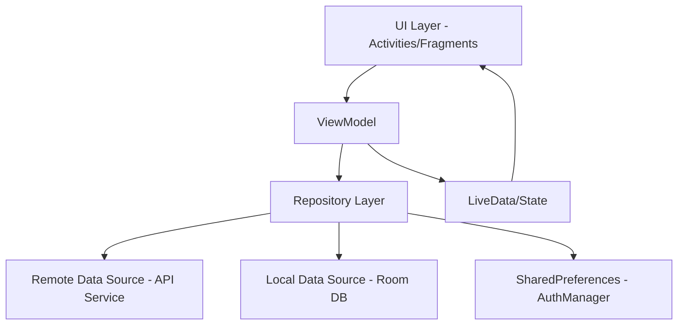
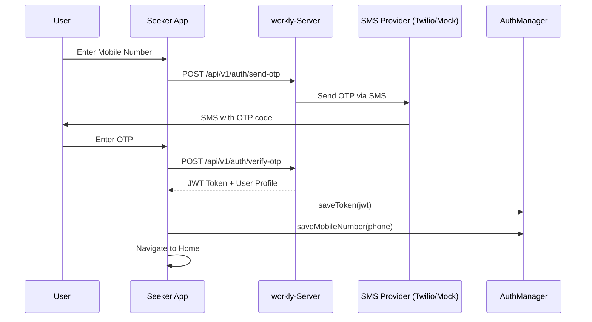
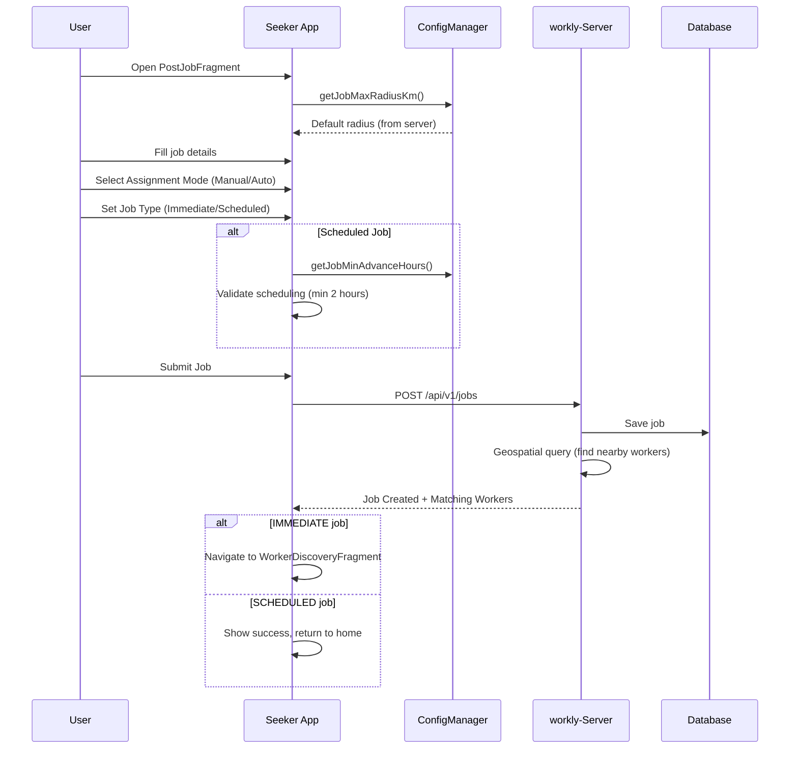
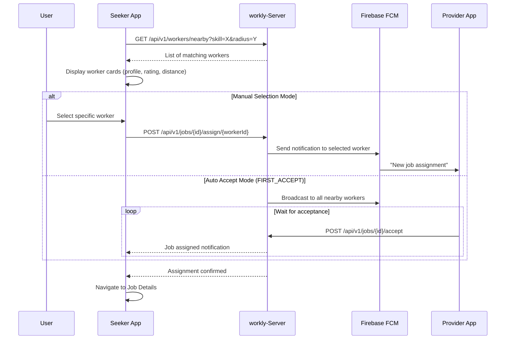
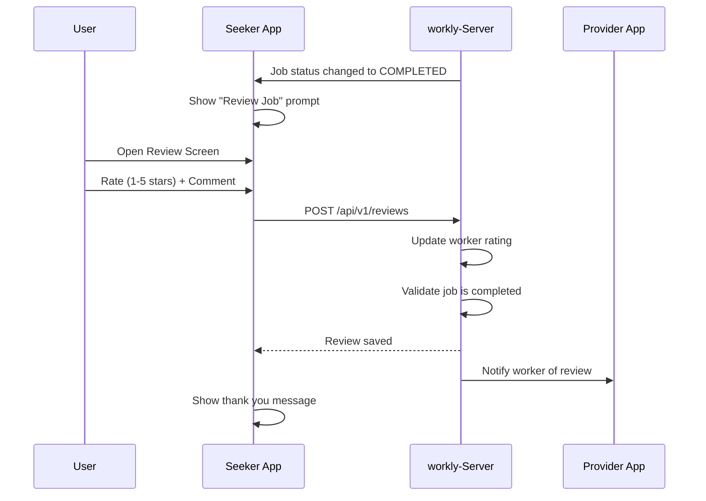
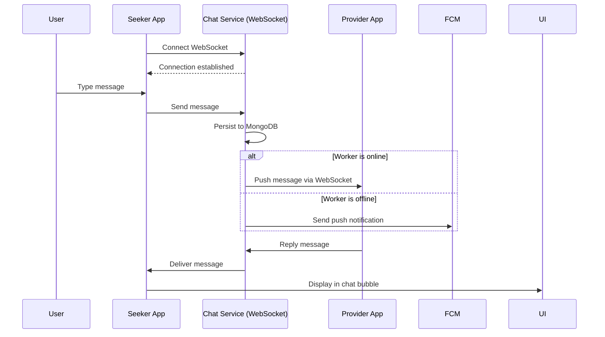
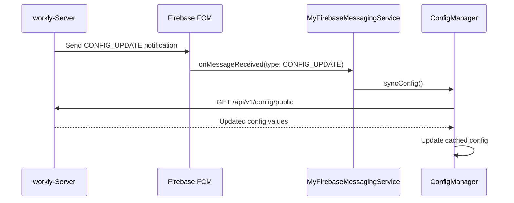

# Workly Help Seeker App - Architecture

## Overview

The **Workly Help Seeker** app is a native Android application for users who need help/services. They can post jobs, search/filter workers, assign jobs (manual or automatic), track job status, and review completed work.

---

## Architecture Pattern

**MVVM (Model-View-ViewModel)** with **Repository Pattern**



### Key Components

- **UI Layer**: Activities, Fragments (PostJobFragment, WorkerDiscoveryFragment, ChatFragment)
- **ViewModel**: JobViewModel, ChatViewModel
- **Repository**: API coordination, data caching
- **Data Sources**:
  - Remote: Retrofit API calls to `workly-Server`
  - Local: Room Database (planned)
  - Preferences: AuthManager for JWT and user data
- **DI**: Dagger Hilt for dependency injection

---

## Key Flows

### 1. Authentication Flow (OTP-based)



**Metrics Tracked:**
- Total OTPs sent per seeker
- OTP verification attempts
- SMS provider costs

### 2. Job Posting Flow



**Configuration Used:**
- `jobMaxRadiusKm`: Default search radius (fetched from server)
- `jobMinAdvanceHours`: Minimum scheduling advance time
- `assignmentMode`: Default MANUAL_SELECT or FIRST_ACCEPT

### 3. Worker Discovery & Assignment



### 4. Job Review Flow



**Validation:**
- Only completed jobs can be reviewed
- One review per job
- Rating: 1-5 stars (required)
- Comment: Optional text feedback

### 5. Real-Time Chat



### 6. Dynamic Configuration Sync



---

## Third-Party Services & Dependencies

### Free Services
| Service | Purpose | Cost | Setup Required |
|---------|---------|------|----------------|
| **Firebase Cloud Messaging** | Push notifications | Free | Firebase Console |
| **Google Play Services Location** | Get current location for job posting | Free | Google API Console |
| **Retrofit** | HTTP client | Free (Open Source) | N/A |
| **Room** | Local database | Free (Android Jetpack) | N/A |
| **Dagger Hilt** | Dependency injection | Free (Open Source) | N/A |

### Planned Paid Services
| Service | Purpose | Estimated Cost | Status |
|---------|---------|----------------|--------|
| **Google Maps SDK** | Show worker locations, job sites | ~$2 per 1000 loads (28K free/month) | Planned |
| **Twilio SMS** | OTP delivery | ~$0.0079 per SMS | Configured (mock in dev) |

### Cost Estimates (Monthly)

**Scenario: 1000 active seekers**
- **OTPs**: 1000 users × 2 OTPs/month = 2000 OTPs = ~$16/month
- **Maps**: 1000 users × 10 map loads/month = 10,000 loads = Free (under 28K)
- **FCM**: Unlimited free

**At Scale (10,000 users):**
- **OTPs**: 20,000 OTPs = ~$160/month
- **Maps**: 100,000 loads = ~$140/month (after free tier)
- **Total**: ~$300/month for 10K users

---

## Data Storage

### SharedPreferences (AuthManager)
- `auth_token`: JWT for API calls
- `mobile_number`: User's phone number

### Room Database (Planned)
- Posted jobs cache
- Chat messages
- Worker profiles (offline browsing)

### Remote API
- Primary data source: `workly-Server`

---

## Metrics & Analytics Strategy

### Current Tracked Metrics
- Job posting events
- Worker search queries
- Review submissions
- Chat messages sent
- FCM notifications received

### Planned Backend Collection

**Backend Endpoint**: `POST /api/v1/metrics/record`

```json
{
  "userId": "919876543210",
  "eventType": "MAP_LOADED",
  "metadata": {
    "screenName": "WorkerDiscovery",
    "timestamp": 1735567200000
  }
}
```

**Metrics to Track:**

1. **Maps Usage**
   - Map loads per seeker
   - Average maps per job posting
   - Monthly Maps API cost projection

2. **SMS/OTP Costs**
   - OTP requests per seeker
   - Failed OTP attempts (for fraud detection)
   - Monthly SMS costs

3. **Feature Usage**
   - Job posting frequency
   - Manual vs Auto-accept ratio
   - Review submission rate
   - Chat engagement metrics

4. **Performance**
   - API response times
   - WebSocket connection stability
   - Offline/online transitions

**Admin Dashboard Metrics:**
- Real-time cost tracker (SMS + Maps)
- Cost per active user
- Usage trends and forecasts

---

## Configuration Management

**Dynamic Config Keys** (from server):
- `otpResendDelaySeconds`: OTP button cooldown
- `debugEnabled`: Verbose logging
- `jobMaxRadiusKm`: Default job search radius
- `jobMinAdvanceHours`: Minimum job scheduling time
- `assignmentMode`: Default MANUAL_SELECT or FIRST_ACCEPT
- `chatUrl`: WebSocket server URL
- `monetisation.enabled`: Revenue features flag
- `monetisation.allowBrowseWithoutPayment`: Free browsing toggle

**Local Config** (`config.properties`):
- `backend.url`: API base URL (only one hardcoded value)

---

## Security

- **Authentication**: JWT tokens in SharedPreferences
- **API Security**: All requests include `Authorization` header
- **Data Validation**: Server-side validation for job parameters
- **Permissions**: Location (for job posting), Notifications
- **Chat Encryption**: Future enhancement

---

## Build & Deployment

### Debug Build
```bash
./gradlew :app:assembleDebug
```

### Release Build
```bash
./gradlew :app:assembleRelease
```

### Dependencies
- Minimum SDK: 21 (Android 5.0)
- Target SDK: 34 (Android 14)
- Java Version: 8

---

## Future Enhancements

1. **Google Maps Integration**
   - Show worker locations on map
   - Visualize job radius
   - Route to worker's location
   - Track cost per map load

2. **Payment Integration**
   - Stripe/Razorpay SDK
   - In-app job payments
   - Wallet system

3. **Advanced Metrics Dashboard**
   - Real-time cost monitoring in app
   - Budget alerts (e.g., "Maps usage at 80% of free tier")
   - Usage recommendations

4. **Offline Mode**
   - Browse cached worker profiles
   - Queue job posts for later
   - Offline chat message drafts

5. **Monetization Features**
   - Premium seeker accounts
   - Priority worker matching
   - Featured job listings
