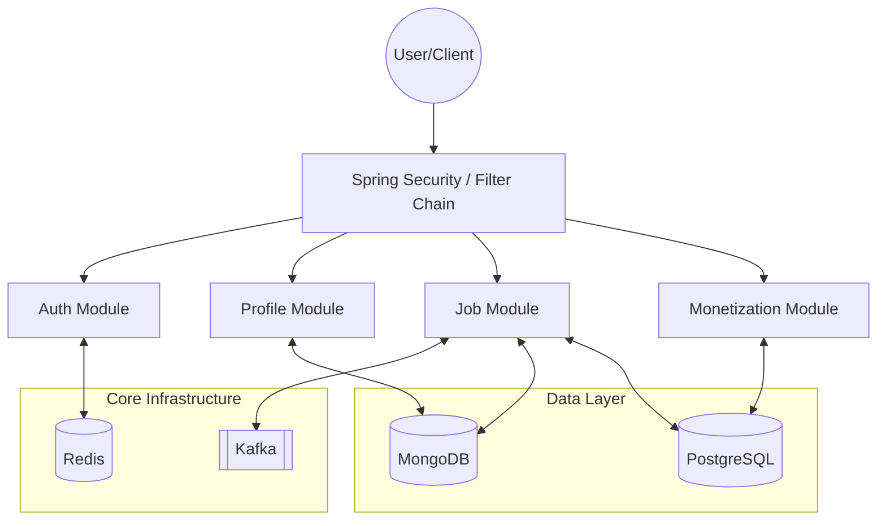

# Workly Server Architecture

Workly is a high-performance, scalable platform designed to connect service seekers with local skilled workers in real-time. This document outlines the technical architecture, data flow, and core components of the backend server.

---

## 1. System Overview
Workly is built as a Spring Boot monolith that is designed with modularity in mind, allowing for easy transitions to a microservices architecture if needed. It leverages a mix of Polyglot Persistence to handle different data requirements.

---

## 2. Technology Stack

- **Core Framework**: Java 17 + Spring Boot 3.4.1
- **Security**: Spring Security + JWT (Stateless)
- **Primary Database (Unstructured)**: MongoDB (for Profiles, Jobs, and Reviews)
- **Secondary Database (Relational)**: PostgreSQL (for Subscriptions and Job Completions)
- **Caching & Ephemeral Storage**: Redis (for OTPs, JWT blacklisting, and distributed locking)
- **Messaging Service**: Apache Kafka (for asynchronous job state events and matching)
- **Build Tool**: Gradle

---

## 3. Core Modules

### 3.1 Authentication Module
Handles user onboarding and secure session management.
- **OTP System**: Generates and validates mobile-based OTPs, stored temporarily in Redis.
- **JWT**: Issues stateless bearer tokens for authenticated requests.
- **Identity**: Uses mobile numbers as the primary unique identifier.

### 3.2 Profile Module
Manages both **Worker** and **Skill Seeker** personas.
- **Geospatial Tracking**: Stores worker coordinates in MongoDB using `2dsphere` indexes for proximity searches.
- **Availability**: Real-time toggle for worker visibility.

### 3.3 Job Tracking & Management
The lifecycle of a service request.
- **Creation**: Logic for broadcast vs. manual selection.
- **State Machine**: Transitions from `CREATED` -> `BROADCASTED` -> `ASSIGNED` -> `COMPLETED`.
- **Events**: Publishes status changes to Kafka for downstream processing (notifications, analytics).

### 3.4 Matching Engine
A location-aware component that filters available workers within a specific radius of a job posting. It uses MongoDB's geospatial queries combined with business logic (skills, rating, availability).

### 3.5 Monetization & Subscription
Manages premium features and access control.
- **PostgreSQL Persistence**: Ensures ACID compliance for financial records and subscription validity.
- **Grace Periods**: Logic for handling expired vs. active access.

---

## 4. Data Flow

1. **Request Entry**: All requests pass through a JWT validation filter.
2. **Context Persistence**: The `Authentication` object is injected into `SecurityContextHolder`, allowing controllers to reliably retrieve the user's mobile number.
3. **Transaction Management**: 
   - MongoDB operations are generally atomic at the document level.
   - PostgreSQL operations use standard JPA `@Transactional` boundaries.
4. **Asynchronous Processing**: Actions like job broadcasts or push notification triggers are handled via Kafka to ensure low-latency response times for the mobile clients.

---

## 5. Scalability & Production Readiness

- **Statelessness**: The server maintains no local session state, allowing for horizontal scaling across multiple instances.
- **Graceful Shutdown**: Integrated with Spring Boot's lifecycle management.
- **Monitoring**: Ready for integration with Actuator and Prometheus for observability.
